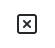

# SVG Fixer

[](https://travis-ci.org/github/oslllo/svg-fixer)
[](https://www.npmjs.com/package/oslllo-svg-fixer)

Attempts to fix your svg by turning it into a fill / single path (and making it font compatible as a bonus).

## Table Of Contents

1. [Features](#features)
2. [Why did I create this package](#why-did-i-create-this-package)
3. [Installation](#installation)
4. [Usage](#usage)

## Features

- Makes SVGs font compatable.
- Converts SVG elements into a single [path](https://developer.mozilla.org/en-US/docs/Web/SVG/Element/path) element.
- Converts SVG [Strokes To Fill](https://icomoon.io/#docs/stroke-to-fill).

## Why did I create this package ❓

- **`OBJECTIVE:`** I wanted to convert some svg icons into fonts using tools like [icomoon.io](https://icomoon.io/app/#/select), [fontello.com](http://fontello.com) and [webfont](https://www.npmjs.com/package/webfont)

- **`PROBLEM:`** If your svg containts `strokes` or any tags besides a single `path` e.g `polygon` `rect` `line` etc, you will get these errors when trying to convert them into fonts.

    ---

    <h3>Example</h3>

    <blockquote>The SVG we will be using for this example:</blockquote>

    <h4><pre>SVG Icon</pre></h4>

    

    <h4><pre>SVG Code</pre></h4>

    ```xml
    <svg
    xmlns="http://www.w3.org/2000/svg"
    width="24"
    height="24"
    viewBox="0 0 24 24"
    fill="none"
    stroke="currentColor"
    stroke-width="2"
    stroke-linecap="round"
    stroke-linejoin="round">
    <rect x="3" y="3" width="18" height="18" rx="2" ry="2" />
    <line x1="9" y1="9" x2="15" y2="15" />
    <line x1="15" y1="9" x2="9" y2="15" />
    </svg>
    ```

    ---

    **Errors when we try to convert this svg into a font using some `SVG to font` conversion tools.**

    ---

    | [icomoon.io](https://icomoon.io/app/#/select) error | [fontello.com](http://fontello.com) error | [webfont](https://www.npmjs.com/package/webfont) error |
    |---------------------------|------------------------------|------------------------------|
    | [](media/images/icomoon-error.png) | [](media/images/fontello-error.png) | [](media/images/webfont-error.png) |

---

- **`WHAT HAPPENDS IF WE IGNORE THESE ERRORS?:`** The font pack with the icon(s) will come out "corrupt", different than expected or not even coming out at all (blank), in this case the icon won't render in the font, it will just show up as a blank character.

    ---

    **Our icon not showning up or rendering in the font pack when we ignore the errors and just create the font anyway.**

    ---

    | [icomoon.io](https://icomoon.io/app/#/select) blank | [fontello.com](http://fontello.com)  blank | [webfont](https://www.npmjs.com/package/webfont) blank <small style="color: #9a9a9a">using [fontdrop.info](https://fontdrop.info) to preview the font</small> |
    |---------------------------|------------------------------|------------------------------|
    | [](media/images/icomoon-blank.png) | [](media/images/fontello-blank.png) | [](media/images/webfont-blank.png) |

- **`SOLUTION:`** I created this very package to solve the issue, now I can "fix" svg icons and make then font compatable by running them through `SVGFixer`.

---

**Our icon in a font pack after we run it through [`SVGFixer()`](https://github.com/oslllo/svg-fixer).**

---

| [icomoon.io](https://icomoon.io/app/#/select) fixed | [fontello.com](http://fontello.com)  fixed | [webfont](https://www.npmjs.com/package/webfont) fixed <small style="color: #9a9a9a">using [fontdrop.info](https://fontdrop.info) to preview the font</small> |
|---------------------------|------------------------------|------------------------------|
| [](media/images/icomoon-fixed.png) | [](media/images/fontello-fixed.png) | [](media/images/webfont-fixed.png) |

---

<h4><pre>Fixed SVG Code</pre></h4>

```xml
<svg xmlns="http://www.w3.org/2000/svg" width="24" height="24" viewBox="0 0 24 24" fill="none" stroke="currentColor" stroke-width="2" stroke-linecap="round" stroke-linejoin="round"><path d="M4.620 2.025 C 4.212 2.105,4.087 2.139,3.870 2.227 C 2.989 2.585,2.321 3.364,2.076 4.320 C 1.993 4.647,1.992 19.351,2.076 19.677 C 2.357 20.776,3.117 21.553,4.260 21.915 C 4.439 21.971,5.243 21.979,11.820 21.990 C 16.818 21.998,19.268 21.989,19.453 21.960 C 20.643 21.777,21.620 20.876,21.924 19.680 C 22.007 19.352,22.008 4.648,21.924 4.323 C 21.617 3.126,20.660 2.233,19.480 2.043 C 19.234 2.003,4.819 1.986,4.620 2.025 M19.340 4.066 C 19.455 4.105,19.603 4.201,19.701 4.299 C 20.025 4.623,20.000 3.977,20.000 12.000 C 20.000 20.023,20.025 19.377,19.701 19.701 C 19.377 20.025,20.023 20.000,12.000 20.000 C 3.975 20.000,4.623 20.025,4.298 19.700 C 3.974 19.376,3.998 20.028,4.010 11.918 L 4.020 4.700 4.131 4.511 C 4.256 4.298,4.449 4.136,4.670 4.057 C 4.793 4.013,6.104 4.003,11.983 4.002 C 18.548 4.000,19.162 4.006,19.340 4.066 M8.643 8.069 C 8.291 8.193,8.000 8.614,8.000 9.000 C 8.000 9.080,8.030 9.234,8.066 9.343 C 8.123 9.517,8.276 9.685,9.354 10.770 L 10.577 12.000 9.354 13.230 C 8.276 14.315,8.123 14.483,8.066 14.657 C 7.936 15.046,8.021 15.423,8.299 15.701 C 8.577 15.979,8.954 16.064,9.343 15.934 C 9.517 15.877,9.685 15.724,10.770 14.646 L 12.000 13.423 13.230 14.646 C 14.315 15.724,14.483 15.877,14.657 15.934 C 15.046 16.064,15.423 15.979,15.701 15.701 C 15.979 15.423,16.064 15.046,15.934 14.657 C 15.877 14.483,15.724 14.315,14.646 13.230 L 13.423 12.000 14.646 10.770 C 15.724 9.685,15.877 9.517,15.934 9.343 C 16.064 8.954,15.979 8.577,15.701 8.299 C 15.423 8.021,15.046 7.936,14.657 8.066 C 14.483 8.123,14.315 8.276,13.230 9.354 L 12.000 10.577 10.770 9.354 C 9.685 8.276,9.517 8.123,9.343 8.066 C 9.102 7.985,8.877 7.986,8.643 8.069 " stroke="none" fill="black" fill-rule="evenodd"></path></svg>
```

## Installation

```shell
npm install oslllo-svg-fixer
```

## Usage

```js
const svgfixer = require('oslllo-svg-fixer');
```

#### Using `svgfixer.fix()` wrapper

```js
async function svgfixerFixExample() {
    // You can use a path that points to a directory with SVGs.
    await svgfixer.fix('directory/containing/svgs', 'directory/to-store/fixed-svgs');
    // Or a path that point directly so a single file.
    await svgfixer.fix('directory/containing/broken-icon.svg', 'directory/to-store/fixed-svgs');
}
```

#### Using `svgfixer.SVGFixer()` class

```js
async function svgfixerSVGFixerExample() {
    // Create a new fixer instance.
    var fixer = new svgfixer.SVGFixer();
    // Set fixer options/parameters
    fixer.setOptions({
        throwIfPathDoesNotExist: true,
        showProgressBar: false,
    });
    // Set source and destination paths
    fixer.setSourceAndDest('directory/containing/svgs', 'directory/to-store/fixed-svgs');
    // Begin processing the SVGs.
    await fixer.process();
}
```

#### Wrapper API `(svgfixer = require("oslllo-svg-fixer"))`

- `svgfixer.fix(source, destination, options)`: Wrapper for `SVGFixer` that simplifies use down to one function call. `source` path, `destination` path and parameter `options`.

#### SVGFixer Class API `(svgfixer = new svgfixer.SVGFixer())`

- `svgfixer.setOptions(options)`: set options/paramaters.
- `svgfixer.setSourceAndDest(source, destination)`: set source and destination paths.
- `svgfixer.process()`: begin processing/fixing the SVG files.

## Parameters

- `throwIfPathDoesNotExist`: throw error if any path does not exist. **default(true)**
- `showProgressBar`: show progress bar in CLI. **default(false)**

## Changelog

Please see [CHANGELOG](https://github.com/oslllo/svg-fixer/blob/master/CHANGELOG.md) for more information what has changed recently.

## Test

```shell
npm test
```

## Credits

These amazing font tools I used.

[icomoon.io](https://icomoon.io/app/#/select)

[fontello.com](http://fontello.com)

[webfont](https://www.npmjs.com/package/webfont)

## License

The MIT License (MIT). Please see [License File](https://github.com/oslllo/svg-fixer/blob/master/LICENSE) for more information.
