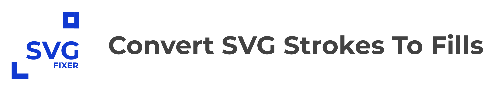
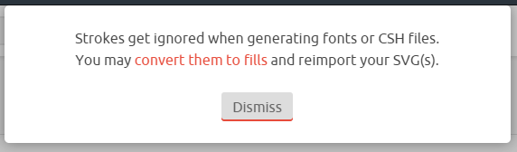
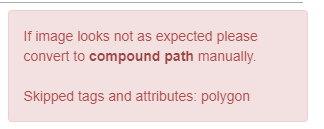
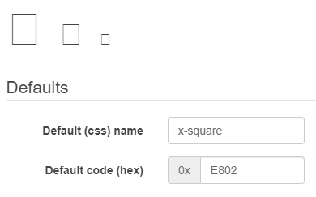
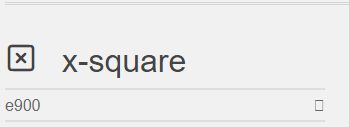

# SVG Fixer



[](https://github.com/oslllo/svg-fixer/actions/workflows/ci.test.yml)
[](https://www.npmjs.com/package/oslllo-svg-fixer)
[](https://coveralls.io/github/oslllo/svg-fixer)

🎉 v3.0.0 Is now 11x faster thanks to @ericfennis, see [#89](https://github.com/oslllo/svg-fixer/pull/89).

🎉 v2.0.0 Removed `Canvas & JSDOM` no more slow `npm install` cycles.

Attempts to fix your svg by turning it into a fill / single path (and making it font compatible as a bonus).

## Convert SVG Strokes To Fills

---


---

## Documentation, Installation, and Usage Instructions

See the full installation and usage documentation [HERE](https://docs.oslllo.com/svg-fixer/master/).

### The Objective

I wanted to convert some `svg icons` to `fonts` using tools like [icomoon.io](https://icomoon.io/app/#/select), [fontello.com](http://fontello.com) and [webfont](https://www.npmjs.com/package/webfont)

### The Problem / Why

If your svg containts `strokes` or any tags besides a single `path` e.g `polygon` `rect` `line` etc, you will get these errors when trying to convert them into fonts.

---

### Example

##### SVG

`Icon` -> <small>we will be using in this example</small>


`Code` -> <small>for the icon</small>

```xml
<svg
xmlns="http://www.w3.org/2000/svg"
width="24"
height="24"
viewBox="0 0 24 24"
fill="none"
stroke="currentColor"
stroke-width="2"
stroke-linecap="round"
stroke-linejoin="round">
<rect x="3" y="3" width="18" height="18" rx="2" ry="2" />
<line x1="9" y1="9" x2="15" y2="15" />
<line x1="15" y1="9" x2="9" y2="15" />
</svg>
```

---

### Errors

When we try to convert this `SVG` into a font using one of these `SVG To Font` conversion tools we get the following errors.

| [icomoon.io](https://icomoon.io/app/#/select) error                              | [fontello.com](http://fontello.com) error                                           | [webfont](https://www.npmjs.com/package/webfont) error                           |
| -------------------------------------------------------------------------------- | ----------------------------------------------------------------------------------- | -------------------------------------------------------------------------------- |
| [](docs/images/icomoon-error.png) | [](docs/images/fontello-error.png) | [](docs/images/webfont-error.png) |

<!-- ### WHAT HAPPENDS IF WE IGNORE THESE ERRORS? -->

### Ignoring The Errors

<!-- ### What Happends If We Ignore These Errors? -->

What happends if you ignore these errors? well, the font pack with the icon(s) will come out `"corrupt/incorrect"`, `different than expected` or `not even render at all` (blank).

### Results From Ignoring The Errors

> The icon not showning up or rendering in the font pack when we ignore the errors and just create the font anyway.

| [icomoon.io](https://icomoon.io/app/#/select) blank                              | [fontello.com](http://fontello.com) blank                                           | [webfont](https://www.npmjs.com/package/webfont) blank <small style="color: #9a9a9a">using [fontdrop.info](https://fontdrop.info) to preview the font</small> |
| -------------------------------------------------------------------------------- | ----------------------------------------------------------------------------------- | ------------------------------------------------------------------------------------------------------------------------------------------------------------- |
| [](docs/images/icomoon-blank.png) | [](docs/images/fontello-blank.png) | [](docs/images/webfont-blank.png)                                                                              |

### The Solution

I created this `package` to solve this issue, now you can `"fix"` svg icons to make then font compatable by running them through `SVGFixer`.

### Fixing The Icon

The icon in a font pack after we run it through [`SVGFixer()`](https://github.com/oslllo/svg-fixer).

| [icomoon.io](https://icomoon.io/app/#/select) fixed                              | [fontello.com](http://fontello.com) fixed                                           | [webfont](https://www.npmjs.com/package/webfont) fixed <small style="color: #9a9a9a">using [fontdrop.info](https://fontdrop.info) to preview the font</small> |
| -------------------------------------------------------------------------------- | ----------------------------------------------------------------------------------- | ------------------------------------------------------------------------------------------------------------------------------------------------------------- |
| [](docs/images/icomoon-fixed.png) | [](docs/images/fontello-fixed.png) | [](docs/images/webfont-fixed.png)                                                                              |

---

### Fixed SVG Code

```xml
<svg xmlns="http://www.w3.org/2000/svg" width="24" height="24" viewBox="0 0 24 24" fill="none" stroke="currentColor" stroke-width="2" stroke-linecap="round" stroke-linejoin="round"><path d="M4.620 2.025 C 4.212 2.105,4.087 2.139,3.870 2.227 C 2.989 2.585,2.321 3.364,2.076 4.320 C 1.993 4.647,1.992 19.351,2.076 19.677 C 2.357 20.776,3.117 21.553,4.260 21.915 C 4.439 21.971,5.243 21.979,11.820 21.990 C 16.818 21.998,19.268 21.989,19.453 21.960 C 20.643 21.777,21.620 20.876,21.924 19.680 C 22.007 19.352,22.008 4.648,21.924 4.323 C 21.617 3.126,20.660 2.233,19.480 2.043 C 19.234 2.003,4.819 1.986,4.620 2.025 M19.340 4.066 C 19.455 4.105,19.603 4.201,19.701 4.299 C 20.025 4.623,20.000 3.977,20.000 12.000 C 20.000 20.023,20.025 19.377,19.701 19.701 C 19.377 20.025,20.023 20.000,12.000 20.000 C 3.975 20.000,4.623 20.025,4.298 19.700 C 3.974 19.376,3.998 20.028,4.010 11.918 L 4.020 4.700 4.131 4.511 C 4.256 4.298,4.449 4.136,4.670 4.057 C 4.793 4.013,6.104 4.003,11.983 4.002 C 18.548 4.000,19.162 4.006,19.340 4.066 M8.643 8.069 C 8.291 8.193,8.000 8.614,8.000 9.000 C 8.000 9.080,8.030 9.234,8.066 9.343 C 8.123 9.517,8.276 9.685,9.354 10.770 L 10.577 12.000 9.354 13.230 C 8.276 14.315,8.123 14.483,8.066 14.657 C 7.936 15.046,8.021 15.423,8.299 15.701 C 8.577 15.979,8.954 16.064,9.343 15.934 C 9.517 15.877,9.685 15.724,10.770 14.646 L 12.000 13.423 13.230 14.646 C 14.315 15.724,14.483 15.877,14.657 15.934 C 15.046 16.064,15.423 15.979,15.701 15.701 C 15.979 15.423,16.064 15.046,15.934 14.657 C 15.877 14.483,15.724 14.315,14.646 13.230 L 13.423 12.000 14.646 10.770 C 15.724 9.685,15.877 9.517,15.934 9.343 C 16.064 8.954,15.979 8.577,15.701 8.299 C 15.423 8.021,15.046 7.936,14.657 8.066 C 14.483 8.123,14.315 8.276,13.230 9.354 L 12.000 10.577 10.770 9.354 C 9.685 8.276,9.517 8.123,9.343 8.066 C 9.102 7.985,8.877 7.986,8.643 8.069 " stroke="none" fill="black" fill-rule="evenodd"></path></svg>
```

---
