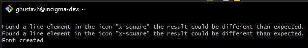
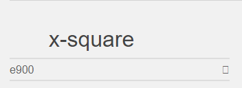
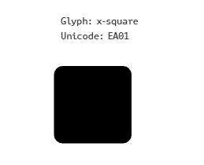
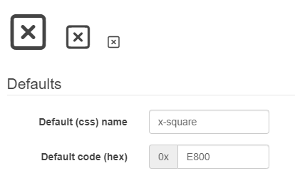
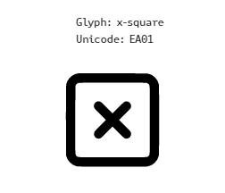

# SVG Fixer


Attempts to fix your svg by turning it into a fill / single path (and making it font compatible as a bonus).

## Table Of Contents

1. [Features](#features)
2. [Why did I create this package](#why-did-i-create-this-package)
3. [Installation](#installation)
4. [Usage](#usage)

## Features

- Makes SVGs font compatable.
- Converts SVG elements into a single [path](https://developer.mozilla.org/en-US/docs/Web/SVG/Element/path) element.
- Converts SVG [Strokes To Fill](https://icomoon.io/#docs/stroke-to-fill).

## Why did I create this package ❓

- **`OBJECTIVE:`** I wanted to convert some svg icons into fonts using tools like [icomoon.io](https://icomoon.io/app/#/select), [fontello.com](http://fontello.com) and [webfont](https://www.npmjs.com/package/webfont)

- **`PROBLEM:`** If your svg containts `strokes` or any tags besides a single `path` e.g `polygon` `rect` `line` etc, you will get these errors when trying to convert them into fonts.

    ---

    ### Example

    > The SVG we will be using for this example:

    #### `SVG Icon`

    <svg xmlns="http://www.w3.org/2000/svg" width="24" height="24" viewBox="0 0 24 24" fill="none" stroke="currentColor" stroke-width="2" stroke-linecap="round" stroke-linejoin="round"><rect x="3" y="3" width="18" height="18" rx="2" ry="2" /><line x1="9" y1="9" x2="15" y2="15" /><line x1="15" y1="9" x2="9" y2="15" /></svg>

    #### `SVG Code`

    ```xml
    <svg
    xmlns="http://www.w3.org/2000/svg"
    width="24"
    height="24"
    viewBox="0 0 24 24"
    fill="none"
    stroke="currentColor"
    stroke-width="2"
    stroke-linecap="round"
    stroke-linejoin="round">
    <rect x="3" y="3" width="18" height="18" rx="2" ry="2" />
    <line x1="9" y1="9" x2="15" y2="15" />
    <line x1="15" y1="9" x2="9" y2="15" />
    </svg>
    ```

    ---

    **Errors when we try to convert this svg into a font using some `SVG to font` conversion tools.**

    ---

    | [icomoon.io](https://icomoon.io/app/#/select) error | [fontello.com](http://fontello.com) error | [webfont](https://www.npmjs.com/package/webfont) error |
    |---------------------------|------------------------------|------------------------------|
    | [](media/images/icomoon-error.png) | [](media/images/fontello-error.png) | [](media/images/webfont-error.png) |

---

- **`WHAT HAPPENDS IF WE IGNORE THESE ERRORS?:`** The font pack with the icon(s) will come out "corrupt", different than expected or not even coming out at all (blank), in this case the icon won't render in the font, it will just show up as a blank character.

    ---

    **Our icon not showning up or rendering in the font pack when we ignore the errors and just create the font anyway.**

    ---

    | [icomoon.io](https://icomoon.io/app/#/select) blank | [fontello.com](http://fontello.com)  blank | [webfont](https://www.npmjs.com/package/webfont) blank <small style="color: #9a9a9a">using [fontdrop.info](https://fontdrop.info) to preview the font</small> |
    |---------------------------|------------------------------|------------------------------|
    | [](media/images/icomoon-blank.png) | [](media/images/fontello-blank.png) | [](media/images/webfont-blank.png) |

- **`SOLUTION:`** I created this very package to solve the issue, now I can "fix" svg icons and make then font compatable by running them through `SVGFixer`.

---

**Our icon in a font pack after we run it through [`SVGFixer()`](https://github.com/oslllo/svg-fixer).**

---

| [icomoon.io](https://icomoon.io/app/#/select) fixed | [fontello.com](http://fontello.com)  fixed | [webfont](https://www.npmjs.com/package/webfont) fixed <small style="color: #9a9a9a">using [fontdrop.info](https://fontdrop.info) to preview the font</small> |
|---------------------------|------------------------------|------------------------------|
| [](media/images/icomoon-fixed.png) | [](media/images/fontello-fixed.png) | [](media/images/webfont-fixed.png) |

---

## Installation

```shell
npm install oslllo-svg-fixer
```

## Usage

```js
const svgfixer = require('oslllo-svg-fixer');
```

#### Using `svgfixer.fix()`

```js
async function svgfixerFixExample() {
    // You can use a path that points to a directory with SVGs.
    await svgfixer.fix('directory/containing/svgs', 'directory/to-store/fixed-svgs');
    // Or a path that point directly so a single file.
    await svgfixer.fix('directory/containing/broken-icon.svg', 'directory/to-store/fixed-svgs');
}
```

#### Using `svgfixer.SVGFixer()`

```js
async function svgfixerSVGFixerExample() {
    // Create a new fixer instance.
    var fixer = new svgfixer.SVGFixer();
    // Set fixer options/parameters
    fixer.setOptions({
        throwIfPathDoesNotExist: true,
        showProgressBar: false,
    });
    // Set source and destination paths
    fixer.setSourceAndDest('directory/containing/svgs', 'directory/to-store/fixed-svgs');
    // Begin processing the SVGs.
    await fixer.process();
}
```

## Wrapper API `(svgfixer = require("oslllo-svg-fixer"))`

- `svgfixer.fix(source, destination, options)`: Wrapper for `SVGFixer` that simplifies use down to one function call. `source` path, `destination` path and parameter `options`.

## SVGFixer Class API `(svgfixer = new svgfixer.SVGFixer())`

- `svgfixer.setOptions(options)`: set options/paramaters.
- `svgfixer.setSourceAndDest(source, destination)`: set source and destination paths.
- `svgfixer.process()`: begin processing/fixing the SVG files.

## Parameters

- `throwIfPathDoesNotExist`: throw error if any path does not exist. **default(true)**
- `showProgressBar`: show progress bar in CLI. **default(false)**

## Changelog

Please see [CHANGELOG](https://github.com/oslllo/svg-fixer/blob/master/CHANGELOG.md) for more information what has changed recently.

## Test

```shell
npm test
```

## Credits

These amazing font tools I used.

[icomoon.io](https://icomoon.io/app/#/select)

[fontello.com](http://fontello.com)

[webfont](https://www.npmjs.com/package/webfont)

## License

The MIT License (MIT). Please see [License File](https://github.com/oslllo/svg-fixer/blob/master/LICENSE) for more information.
